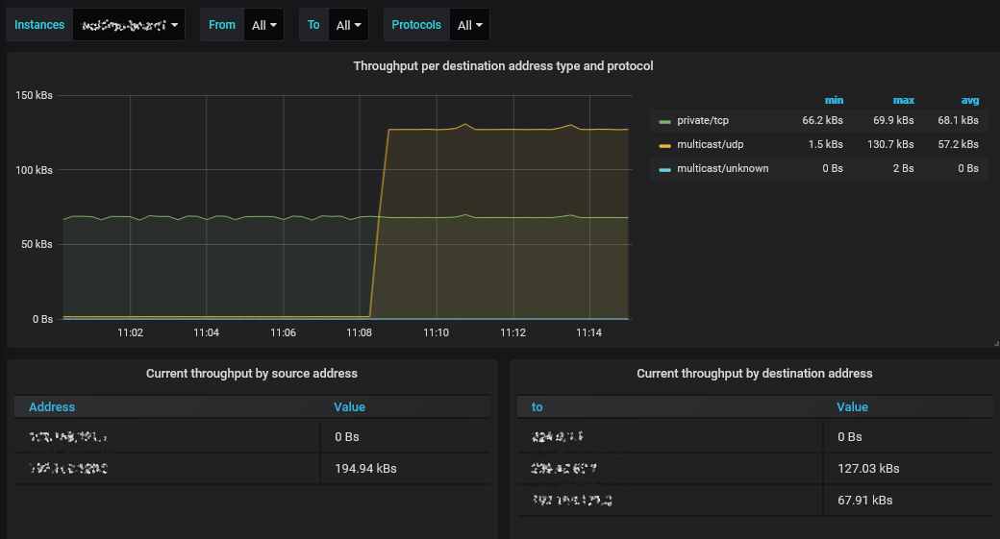

# tzsp_packetstream_exporter

This app exports metrics about packet stream received over TZSP. The goal is to measure what types of data flows are visible on the IPv4 level, without going too far into the packet details.



# Prerequisites

System requirements:

* .NET Core 3.1
* TShark (the command-line variant of [Wireshark](https://www.wireshark.org/#download))
  * On Ubuntu, the `tshark` package is sufficient.
  * On Windows, install the full version of Wireshark.

The `tshark` command must be available in a new terminal. You may need to [register the installation directory in the PATH environment variable](https://www.architectryan.com/2018/03/17/add-to-the-path-on-windows-10/).

**This app only performs the analysis of the packet stream, not the initial capture.** You need to use router to capture the packet stream and provide it in TZSP format to this app.

MikroTik RouterOS has [built-in support for TZSP packet capture](https://wiki.mikrotik.com/wiki/Manual:Tools/Packet_Sniffer). You can also define a [MikroTik firewall mangle rule](https://wiki.mikrotik.com/wiki/Manual:IP/Firewall/Mangle) with the `sniff-tzsp` action, for detailed filtering of captured traffic.

# Quick start

1. Set up a TZSP packet stream to the server this app will be running on. Pick an arbitrary port number for the stream, for example 1234.
1. Execute the app as `tzsp_packetstream_exporter --interface eth0 --port 1234` (see `--help` for more info).
1. Navigate to http://hostname:9184/metrics to explore the available metrics.
1. Register `hostname:9184` in your Prometheus configuration as a scrape target.
1. If using Grafana, install the template dashboard.

Example Prometheus scrape configuration:

```yaml
  - job_name: 'my_packet_analysis'
    static_configs:
      - targets:
        - hostname:9184
```

# Compatibility

Only IPv4 packets are analyzed - IPv6 is ignored.

Only TCP and UDP are analyzed - other transport-level protocols are simply "unknown".

# How do I analyze multiple parallel packet streams?

You could simply direct them at the same analyzer but this will lead to the results being merged.

If you want the results separated in Prometheus, run a separate instance of the analyzer, accepting packets and publishing results on individual ports (`--listen-port` and `--publish-port`, respectively).

# (Any OS) Why do I get a permissions-related error on startup?

The user runnig the app must have the required permissions to use TShark. On Linux, you may need to add the user to the `wireshark` group, depending on system configuration.

# (Windows) Why do I get a permissions-related error on startup?

The app may throw an access denied exception on Windows if your user does not have the right to publish results on the specified port. You can use the *netsh* command to grant yourself the required permissions:

> netsh http add urlacl url=http://+:9184/metrics user=DOMAIN\user

The port number you need to specify here is the publishing port, 9184 by default.